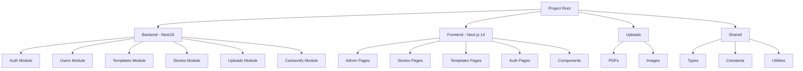

Application web de personnalisation d’histoires pour enfants et adultes, avec génération de livres PDF imprimables et personnalisés (texte + image cartoonifiée).
Développée avec une architecture modulaire NestJS (backend) + Next.js (frontend).

⚙️ Architecture générale

📦 Structure monorepo
/project-root
│
├── /backend # NestJS - API, logique métier, sécurité
│ ├── /src
│ │ ├── /auth
│ │ ├── /users
│ │ ├── /templates
│ │ ├── /stories
│ │ ├── /uploads
│ │ ├── /editor-elements
│ │ └── /cartoonify
│ └── main.ts
│
├── /frontend # Next.js 16 - Interface utilisateur
│ ├── /app
│ │ ├── /admin
│ │ │ ├── /templates
│ │ │ │ ├── /new
│ │ │ │ ├── /[id]
│ │ │ │ │ ├── /edit
│ │ │ │ │ └── /editor
│ │ ├── /story
│ │ ├── /templates
│ │ ├── /auth
│ │ ├── /dashboard
│ │ └── /components
│ ├── /lib
│ ├── /hooks
│ ├── /stores
│ ├── /contexts
│ └── /data
│
├── /uploads # PDF et images uploadés localement
├── /memory-bank # Documentation technique
└── /shared # Types, constantes et utilitaires partagés

🧩 Modules principaux

1. Authentification & rôles

JWT access token (1h) + refresh token (7 jours)

Middleware RolesGuard pour restreindre les routes (Admin, User)

Les tokens sont stockés en cookies HTTP-only.

Pas d'avatar utilisateur.

2. Gestion des Templates (Admin)
   Backend :

Schéma Mongoose :

Template {
\_id,
title,
description,
category,
gender,
ageRange,
pdfPath,
pages,
dimensions: { width, height },
elements: EditorElement[],
isPublished,
createdAt,
updatedAt
}

À la création :

Upload du PDF dans /uploads

Extraction automatique via pdfjs-dist@3.11.174 :

nombre de pages

largeur et hauteur des pages

Enregistrement dans la base de données.

Frontend :

/admin/templates → vue liste (pas cartes) avec actions (éditer, supprimer, publier)

/admin/templates/new → formulaire complet upload + métadonnées

/admin/templates/[id]/editor → éditeur PDF interactif avec drag & resize

Dark mode + responsive + validation UX

4. Module Story (User)
   Backend :

Schéma :

Story {
\_id,
templateId,
userId,
variables: Record<string, string>,
generatedPdfUrl,
createdAt
}

Le titre de la Story = template.title

Génération PDF :

Le backend charge le template PDF

Injecte les variables texte

Remplace les zones image par les images cartoonifiées

Produit un nouveau PDF sauvegardé localement ou dans /uploads/stories

Retourne un lien sécurisé pour téléchargement via endpoint backend

Frontend :

/story → bibliothèque templates avec filtres, recherche, grille responsive

/stories/create/[templateId] → formulaire dynamique basé sur les variables du template

Upload d'image utilisateur → envoi à API de cartoonification

Preview avant génération

Bouton "Générer mon histoire"

5. Cartoonification & traitement d’image
   Process :

L’utilisateur upload son image.

Le backend appelle une API externe (ex : Replicate / Hugging Face) :

Suppression du fond

Application du style cartoon

Le backend remplace la zone image correspondante dans le PDF.

Le PDF final est généré avec pdf-lib ou pdfkit.

🌐 Routing Frontend
Page Rôle Description
/ Public Landing page (Hero, CTA, design immersif)
/login, /register Public Authentification
/story User/Public Bibliothèque templates avec filtres et recherche
/templates User/Public Liste des templates disponibles (legacy)
/stories User Mes histoires personnalisées
/stories/create/[id] User Formulaire de personnalisation
/admin Admin Dashboard global
/admin/templates Admin Liste des templates (vue liste)
/admin/templates/new Admin Création d'un template
/admin/templates/[id]/edit Admin Édition d'un template
/admin/templates/[id]/editor Admin Éditeur PDF interactif
🧠 Navbar & UI Globale

Une Navbar universelle, affichée sur toutes les pages :

Affiche des liens variables selon le rôle :

Public : Home, Templates, Login/Register

User : Home, Templates, My Stories, Logout

Admin : Dashboard, Templates, Logout

Détection automatique du rôle via token

Support du dark mode (localStorage + fallback système)

UI : TailwindCSS v4 + shadcn/ui + Framer Motion + Lucide React + react-rnd

📊 Sécurité & bonnes pratiques

Uploads PDF & images → validations MIME type + taille max

Tokens HTTP-only

Vérification des rôles sur routes sensibles

Téléchargement PDF via endpoint sécurisé (pas accès direct au fichier)

CORS configuré entre front et back

Hash mot de passe : bcrypt

🔮 Évolutions futures

Ajout d’un “mode adulte” : histoires personnalisées pour couples, mariages, anniversaires.

Paiement à la livraison (Cash on Delivery)

Statistiques d’usage (histoires créées, impressions)

API IA de génération automatique d’histoires à partir de prompts.