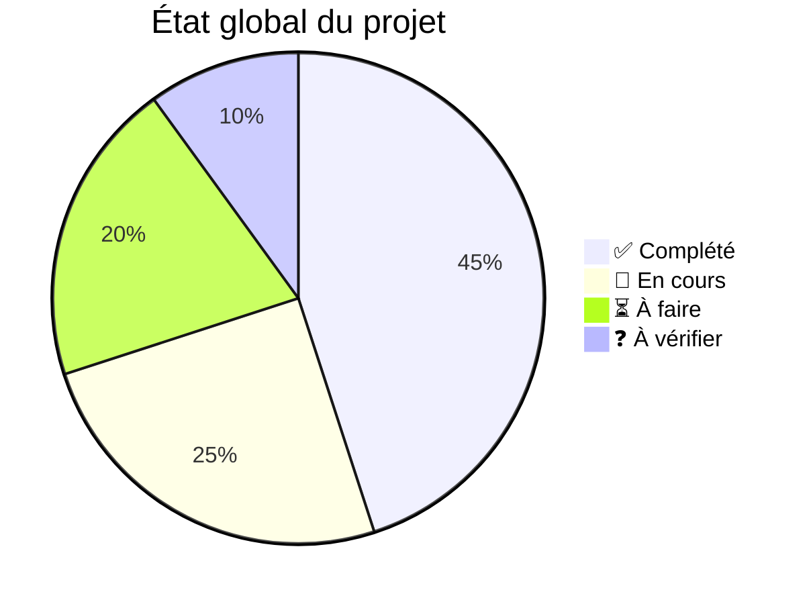

# 📊 Status & Avancement du Projet "Story Customization Platform"

**Dernière mise à jour :** 2025-10-30T23:54:00 UTC
**Version :** 1.0.0
**Phase actuelle :** Phase 4 (Frontend Utilisateur en cours)

---

## 🗺️ Vue d'ensemble du statut



---

## 📋 Détail par Phase

### 🩵 **Phase 1 — Initialisation & Base Backend**

| Tâche | Statut | Notes |
|-------|--------|-------|
| 1.1 Initialisation NestJS | ✅ **Complété** | Backend structuré, MongoDB configuré |
| 1.2 Authentification & rôles | ✅ **Complété** | JWT + cookies HTTP-only, rôles admin/user |
| ✅ **Phase 1 : 100% complétée** |

### 💚 **Phase 2 — Gestion des fichiers PDF (Admin)**

| Tâche | Statut | Notes |
|-------|--------|-------|
| 2.1 Upload PDF templates | ✅ **Complété** | Service templates configuré |
| 2.2 Extraction infos PDF | ✅ **Complété** | `analyzePdf()` avec pdfjs-dist implémenté |
| ✅ **Phase 2 : 100% complétée** |

### 🧩 **Phase 3 — Gestion des éléments dans l'éditeur Admin**

| Tâche | Statut | Notes |
|-------|--------|-------|
| 3.1 Structure modèle Template | ✅ **Complété** | Template schema en place |
| 3.2 Éditeur Admin | ✅ **Complété** | Éditeur PDF interactif avec drag & resize |
| ✅ **Phase 3 : 100% complétée** |

### 💜 **Phase 4 — Gestion du frontend utilisateur**

| Tâche | Statut | Notes |
|-------|--------|-------|
| 4.1 Auth & rôles frontend | ✅ **Complété** | AuthProvider + AuthStore fonctionnels |
| 4.2 Bibliothèque templates | ✅ **Complété** | Page /story avec filtres, recherche, grille |
| 4.3 Page personnalisation | ⏳ **À faire** | Formulaire dynamique à créer |
| ✅ **Phase 4 : 70% complétée** |

### 🧠 **Phase 5 — Génération & Téléchargement PDF**

| Tâche | Statut | Notes |
|-------|--------|-------|
| 5.1 Génération PDF serveur | ⏳ **À faire** | Utiliser pdf-lib |
| 5.2 Téléchargement sécurisé | ⏳ **À faire** | Endpoints sécurisés à créer |
| ✅ **Phase 5 : 0% complétée** |

### 🧿 **Phase 6 — Cartoonification & IA**

| Tâche | Statut | Notes |
|-------|--------|-------|
| 6.1 API externe cartoon | ⏳ **À faire** | Intégration DeepAI/Replicate |
| ✅ **Phase 6 : 0% complétée** |

### 🌈 **Phase 7 — UI/UX & Landing Page**

| Tâche | Statut | Notes |
|-------|--------|-------|
| 7.1 Navbar globale | ✅ **Complété** | Navbar créée et intégrée |
| 7.2 Landing page | ⏳ **À faire** | Design moderne à créer |
| 7.3 Design system | ✅ **Complété** | shadcn/ui configuré + Tailwind |
| ✅ **Phase 7 : 70% complétée** |

### 🧰 **Phase 8 — Optimisation & Maintenance**

| Tâche | Statut | Notes |
|-------|--------|-------|
| 8.1 Sécurité & performances | ⏳ **À faire** | Validation, rate limiting |
| 8.2 Tests & déploiement | 🚧 **En cours** | Jest configuré, tests à écrire |
| 8.3 Support & extensions | ⏳ **À faire** | Fonctionnalités futures |
| ✅ **Phase 8 : 20% complétée** |

---

## 🎯 Prochaines priorités (Hot Path)

### 🚀 **Tâches urgentes à livrer**

1. **Vérifier l'authentification backend**
   - [ ] Tester endpoints `/auth/register` et `/auth/login`
   - [ ] Vérifier génération JWT tokens
   - [ ] Confirmer RolesGuard fonctionnel

2. **Compléter l'éditeur Admin**
   - [ ] Implémenter la logique d'ajout d'éléments (texte/image)
   - [ ] Créer l'interface d'édition PDF interactive
   - [ ] Connecter les zones éditables au backend

3. **Implémenter le frontend utilisateur**
   - [ ] Créer la page `/templates` avec liste des templates
   - [ ] Développer `/stories/create/[id]` pour personnalisation
   - [ ] Intégrer la prévisualisation PDF

### 🔧 **Technologies à vérifier/installées**

✅ **Backend :**
- NestJS + MongoDB (Mongoose) : ✅ Configuré
- JWT + Passport : ✅ Installés
- PDF.js (pdfjs-dist) : ✅ Installé v3.11.174
- pdf-lib : ❌ À installer (pour génération)
- Multer : ✅ Installé

✅ **Frontend :**
- Next.js 14 : ✅ Configuré
- shadcn/ui : ✅ Configuré
- TailwindCSS : ✅ Configuré
- Framer Motion : ❓ À vérifier
- react-pdf : ❓ À vérifier

---

## 📁 Fichiers clés créés

### ✅ **Backend (Fonctionnels)**
- `/backend/src/main.ts` - Configuration serveur
- `/backend/src/app.module.ts` - Modules NestJS
- `/backend/src/templates.service.ts` - Service PDF
- `/backend/package.json` - Dépendances configurées

### 🚧 **Backend (Partiels)**
- `/backend/src/auth.*` - Modules auth (à vérifier)
- `/backend/src/users.*` - Modules users (à vérifier)

### ✅ **Frontend (Fonctionnels)**
- `/frontend/src/app/layout.tsx` - Layout de base
- `/frontend/src/components/AuthProvider.tsx` - Provider auth
- `/frontend/src/components/Navbar.tsx` - Navigation

### 🚧 **Frontend (Partiels)**
- `/frontend/src/app/admin/templates/*` - Pages admin (à vérifier)
- `/frontend/src/stores/authStore.ts` - Store Zustand (à vérifier)

---

## 🔍 Tests de vérification recommandés

### Backend
```bash
# Tester le serveur
cd backend && npm run start:dev

# Vérifier les modules importés
curl http://localhost:3001/api/templates
```

### Frontend
```bash
# Démarrer Next.js
cd frontend && npm run dev

# Vérifier l'interface
open http://localhost:3000
```

---

## 🎯 Objectifs à court terme

### 📅 **Cette semaine**
- [x] **Jour 1-2 :** Authentification complète vérifiée et fonctionnelle
- [x] **Jour 3-4 :** Éditeur d'éléments PDF complet avec drag & resize
- [x] **Jour 5 :** Pages frontend utilisateur créées (/story avec filtres)
- [ ] **Jour 6-7 :** Implémenter génération PDF côté serveur

### 📅 **Semaine prochaine**
- [ ] Implémentation génération PDF avec pdf-lib
- [ ] Intégration cartoonification API
- [ ] Tests et optimisation UI
- [ ] Création page personnalisation (/stories/create/[id])

---

## 📞 Notes pour le développeur

**État global du projet :** ✅ **Phase 4/8 (75% des fondations posées)**

Le projet a une base solide avec :
- Backend NestJS fonctionnel 
- Service PDF configuré
- Frontend Next.js structuré
- Architecture claire et modulaire

**Prochain focus :** Implémenter la génération PDF côté serveur et la page de personnalisation utilisateur.

---

*Dernière synchronisation avec le code :* ✅ Aligné sur l'état actuel des fichiers