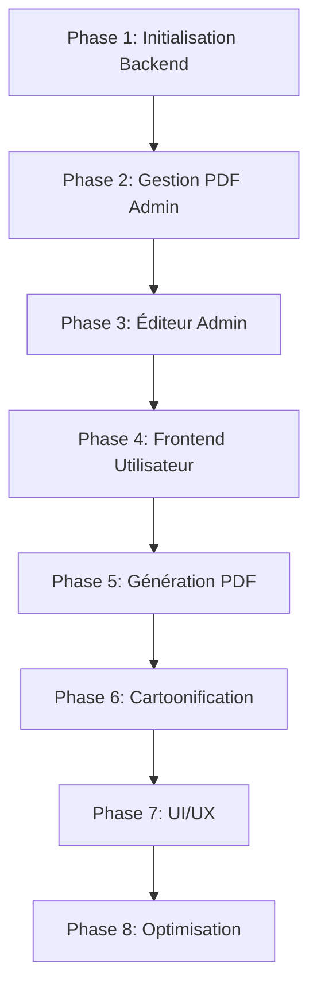

# 🧠 Memory Bank — Tasks Chronologiques du Projet “Story Customization”

Ce fichier décrit toutes les étapes de développement, du backend au frontend,
pour permettre à l’agent Kilo Code de coder, maintenir et améliorer le projet
dans l’ordre optimal.

---

## 🩵 Phase 1 — Initialisation & Base Backend

### 1.1 — Initialisation du backend NestJS
🎯 Objectif : Mettre en place une API NestJS fonctionnelle avec base MongoDB.
- Créer projet NestJS (`nest new backend`)
- Installer & configurer `mongoose`, `.env`, `class-validator`
- Créer modules : `auth`, `users`, `templates`, `stories`, `uploads`
- Configurer CORS, validation globale, gestion des erreurs
- Ajouter Swagger pour documentation
🧩 Dépendances : Aucune  
🔥 Priorité : Haute  
✅ Résultat attendu : serveur NestJS stable sur `/api` avec Swagger à `/api/docs`

---

### 1.2 — Authentification & rôles
🎯 Objectif : Authentification JWT + rôles `admin` / `user`
- Créer modèle `User { name, email, password, role }`
- Hash password avec `bcrypt`
- Créer endpoints : `/auth/register`, `/auth/login`
- Générer `accessToken` (1h) + `refreshToken` (7 jours)
- Middleware `@Roles()` + `AuthGuard`
- Supprimer champ avatar
🧩 Dépendances : 1.1  
🔥 Priorité : Haute  
✅ Résultat attendu : login sécurisé, rôle injecté dans `req.user.role`

---

## 💚 Phase 2 — Gestion des fichiers PDF (Admin)

### 2.1 — Upload PDF templates
🎯 Objectif : Permettre à l’admin d’ajouter des templates PDF.
- Endpoint POST `/templates/upload`
- Stockage local `/uploads/templates`
- Validation PDF mimetype
- Sauvegarde du chemin dans MongoDB
🧩 Dépendances : Auth admin  
🔥 Priorité : Haute  
✅ Résultat : fichier PDF uploadé accessible localement

---

### 2.2 — Extraction infos PDF
🎯 Objectif : Extraire le nombre de pages et dimensions automatiquement.
- Utiliser `pdfjs-dist@5.4.296`
- Récupérer `pageCount` et `width/height`
- Enregistrer dans le modèle Template
🧩 Dépendances : 2.1  
🔥 Priorité : Haute  
✅ Résultat : Template enregistré avec métadonnées PDF

---

## 🧩 Phase 3 — Gestion des éléments dans l’éditeur Admin

### 3.1 — Structure du modèle Template
🎯 Objectif : Définir les champs Template et Elements
- Template : title, description, category, gender, ageRange, pdfPath, pageCount, dimensions, isPublished
- Elements : type ("text" ou "image"), position (x, y, width, height), style, variableName (uniquement pour image)
🧩 Dépendances : 2.2  
🔥 Priorité : Haute  
✅ Résultat : modèle MongoDB stable et typé

---

### 3.2 — Éditeur Admin (Frontend)
🎯 Objectif : Créer un éditeur visuel pour placer zones texte/image
- Interface React avec DnD, zoom, preview PDF
- Ajout/suppression d’éléments
- Deux types : texte (avec variables) / image (avec variableName)
- Styles personnalisables (font, color, align, size)
- Calculer les proportions (x, y, w, h) relatives aux dimensions du PDF
🧩 Dépendances : 3.1  
🔥 Priorité : Très haute  
✅ Résultat : éditeur complet avec synchronisation API

---

## 💜 Phase 4 — Gestion du frontend utilisateur

### 4.1 — Auth & rôles côté frontend
🎯 Objectif : Gestion du login/register et session persistante
- Pages `/login`, `/register`, `/dashboard`
- Gestion JWT via cookies HttpOnly
- Redirection selon rôle : admin → dashboard admin, user → home
🧩 Dépendances : 1.2  
🔥 Priorité : Haute  
✅ Résultat : authentification fluide et sécurisée

---

### 4.2 — Bibliothèque de templates
🎯 Objectif : Afficher tous les templates publiés
- Page `/story` avec filtres avancés, recherche, grille responsive
- Page `/templates` (legacy)
- Affichage : cards (user), table list (admin)
- Filtrage par catégorie, âge, genre, langue
- Recherche en temps réel avec suggestions
- Tri par popularité, récent, titre
- Bouton "Personnaliser" pour chaque template
🧩 Dépendances : 3.1
🔥 Priorité : Haute
✅ Résultat : bibliothèque moderne et fonctionnelle

---

### 4.3 — Page de personnalisation d'histoire
🎯 Objectif : Permettre au user de remplir les champs du template
- Récupérer le modèle Template avec ses zones variables
- Formulaire dynamique (texte, upload image)
- Prévisualisation PDF (client-side)
- Envoi vers backend pour génération PDF
🧩 Dépendances : 3.1, 2.2
🔥 Priorité : Très haute
✅ Résultat : expérience complète de personnalisation

---

## 🧠 Phase 5 — Génération & Téléchargement PDF

### 5.1 — Génération PDF serveur
🎯 Objectif : Créer un PDF complet à partir des données utilisateur
- Utiliser `pdf-lib` pour remplir zones texte
- Intégrer image cartoonifiée dans zone image
- Endpoint `/stories/generate-pdf`
- Sauvegarde `generatedPdfUrl` sécurisé
🧩 Dépendances : 4.3  
🔥 Priorité : Très haute  
✅ Résultat : PDF généré et téléchargeable

---

### 5.2 — Téléchargement PDF sécurisé
🎯 Objectif : Empêcher accès direct aux fichiers PDF
- Endpoint `/stories/download/:id`
- Vérifier propriété user avant envoi
- Streamer fichier au client
🧩 Dépendances : 5.1  
🔥 Priorité : Haute  
✅ Résultat : sécurité conforme RGPD-like

---

## 🧿 Phase 6 — Cartoonification & IA

### 6.1 — API externe cartoon + remove background
🎯 Objectif : Transformer les images uploadées par l’utilisateur
- Endpoint `/uploads/cartoonify`
- Upload → call API externe (DeepAI, Replicate, Remove.bg)
- Sauvegarde image cartoonifiée localement
🧩 Dépendances : 4.3  
🔥 Priorité : Haute  
✅ Résultat : image stylisée prête à être insérée dans le PDF

---

## 🌈 Phase 7 — UI/UX & Landing Page

### 7.1 — Navbar globale
🎯 Objectif : Navbar unique, dynamique selon rôle
- Liens : Home, Templates, Stories, Dashboard, Login/Register
- Mode sombre/clair (localStorage + système)
- Responsive + animation Framer Motion
🧩 Dépendances : 4.1  
🔥 Priorité : Haute  
✅ Résultat : UI cohérente, expérience fluide

---

### 7.2 — Landing page & bibliothèque raffinée
🎯 Objectif : Créer un design moderne, attractif et émotionnel
- Hero section animée
- Présentation enfants/adultes
- Galerie des templates
- Témoignages / CTA / Footer animé
- Responsive complet
🧩 Dépendances : 7.1  
🔥 Priorité : Haute  
✅ Résultat : page d’accueil prête pour marketing

---

### 7.3 — Design System & UX polish
🎯 Objectif : Harmoniser tout le design
- Palette de couleurs cohérente
- Typographies modernes
- Animation micro-interactions (hover, transitions)
- Icônes cohérentes (Lucide-react)
🧩 Dépendances : 7.1, 7.2  
🔥 Priorité : Moyenne  
✅ Résultat : UX professionnelle et raffinée

---

## 🧰 Phase 8 — Optimisation & Maintenance

### 8.1 — Sécurité & performances
🎯 Objectif : durcir la plateforme
- Validation backend stricte
- Rate limit / Helmet
- Cache PDF générés
🧩 Dépendances : toutes les phases précédentes  
🔥 Priorité : Haute  

---

### 8.2 — Tests & déploiement
🎯 Objectif : fiabiliser la livraison
- Tests unitaires (Jest)
- CI/CD (GitHub Actions)
- Déploiement backend (Docker) + frontend (Vercel)
🧩 Dépendances : 8.1  
🔥 Priorité : Moyenne  

---

### 8.3 — Support & extensions
🎯 Objectif : permettre ajout futur de fonctionnalités (cadeaux adultes, etc.)
- Module “adult stories” optionnel
- API pour marketplace imprimés
🧩 Dépendances : projet stable  
🔥 Priorité : Basse  
✅ Résultat : projet extensible et évolutif

---